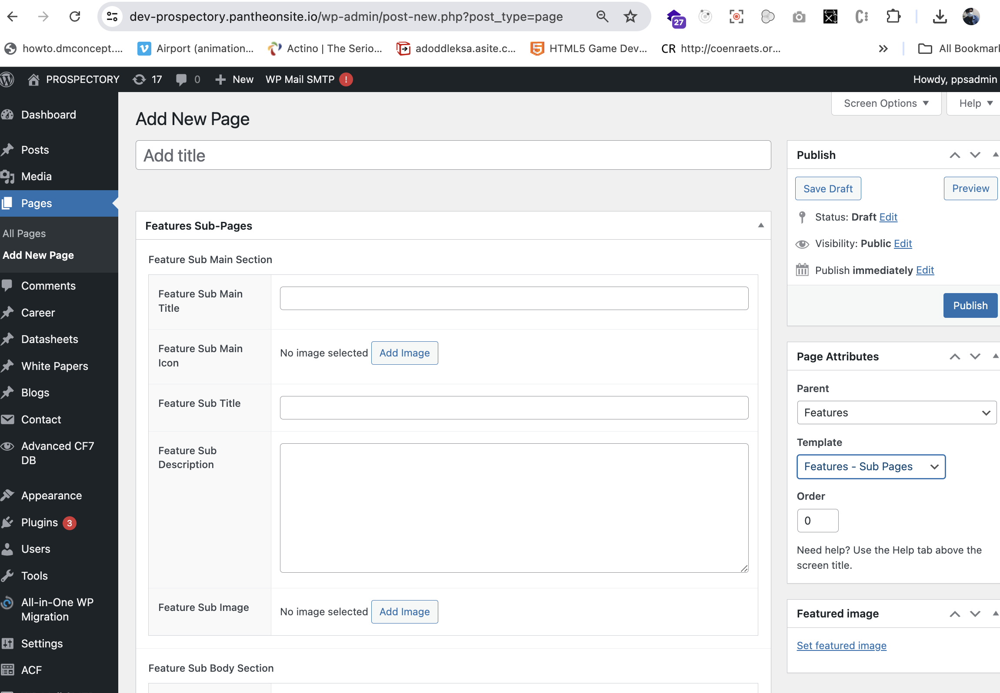

# Features Sub-Pages

## Introduction

We've created a generic custom page template for sub-pages that allows you to easily add or modify content. Follow the steps below to add new features sub-pages.

### Adding New Features Sub-Pages

1. **Navigate to the Pages Section**:

   - Go to the WordPress Admin Dashboard.
   - Locate the left-hand menu.
   - Click on **Pages** to access a list of all pages on your website.

2. **Add a New Feature Sub-Page**:
   - Click the **Add New** button at the top of the page.
   - In the Add New Page screen, under Page Attributes, select **Features** as the Parent Page.
   - Choose the template **Features - Sub Pages** from the Template dropdown.
   - Fill in the Content Fields for Sub-Pages with your desired content, images, and links.

This setup allows for easy creation and customization of sub-pages under the Features section of your website.
     
