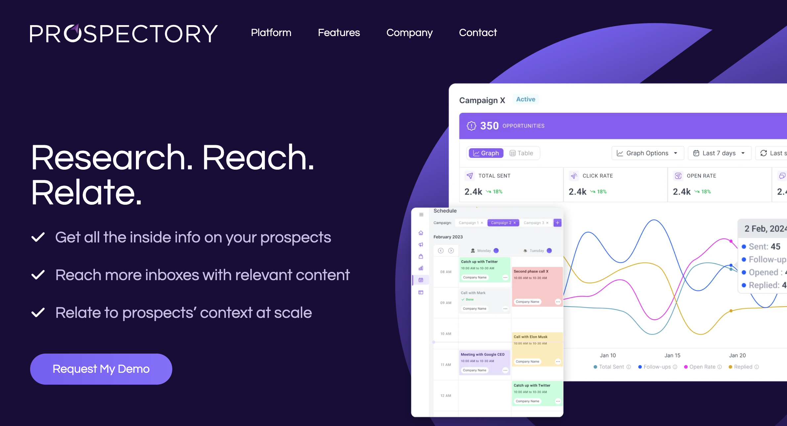

# Introduction

Welcome to the documentation on how to manage content in Prospectory.ai. This guide will help you navigate the WordPress Admin Dashboard, locate the home page, and make the necessary changes

## Prerequisites

- Access to the WordPress Admin Dashboard
- Necessary permissions to edit pages

### Log In to the WordPress Admin Dashboard

1. Open your web browser and navigate to the login page of your WordPress site. This is typically `https://prospectory.ai/wp-admin`.
2. Enter your username and password.
3. Click the **Log In** button.
        
