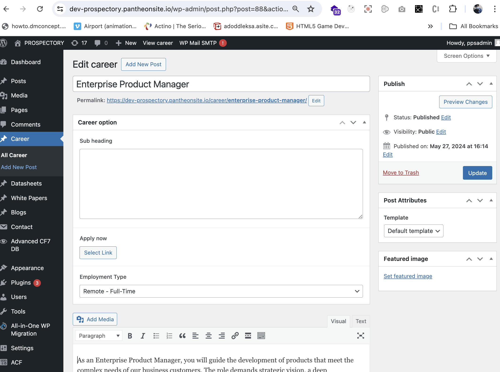

# Managing Careers

## Introduction

We create custom post types like 'Career' to manage job openings effectively. This tutorial will guide you through adding, editing, and deleting career listings in Prospectory.ai.

## Prerequisites

- Access to a WordPress website with administrator privileges.
- Basic familiarity with WordPress administration and content management.

## Step-by-Step Guide

### Creating Career Listings

#### Add a Career Listing

1. **Create a Career Listing**:
   - Go to `Career > Add New`.
   - Enter the title of the job listing in the title field.
   - Enter detailed information about the job in the Main Content area.
   - Optionally, add a Sub-heading for additional details.
   - Select the Employment Type from the dropdown options (Remote Full-time or Remote Part-Time).
   - Add a button link in the Apply now field for candidates to apply.
   - Click "Publish" to make the career listing live on your website.

### Editing Career Listings

#### Edit a Career Listing

1. **Edit a Career Listing**:
   - Navigate to `Career` and find the job listing you want to edit.
   - Click on the job title to open the editor.
   - Make necessary changes to the title, Main Content, Sub-heading, Employment Type, or Apply now field.
   - Click "Update" to save your changes.

### Deleting Career Listings

#### Delete a Career Listing

1. **Delete a Career Listing**:

   - Navigate to `Career`.
   - Hover over the job listing you want to delete.
   - Click on "Trash" to move the listing to the trash.
   - To permanently delete, go to `Trash`, hover over the listing, and click "Delete Permanently."

        
