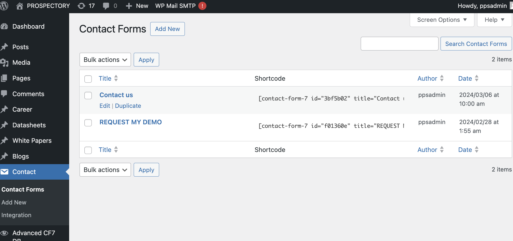

# Managing Contact Forms

## Introduction

Contact Form 7 is a popular WordPress plugin for creating and managing contact forms. This tutorial will guide you through modifying an existing contact form using Contact Form 7 implemented in Prospectory.ai.

## Prerequisites

- Access to a WordPress website with administrator privileges.
- Basic familiarity with WordPress administration and Contact Form 7 settings.

## Step-by-Step Guide

### Accessing Contact Form 7

#### Edit an Existing Contact Form

1. **Edit Contact Form**:
   - In your WordPress dashboard, navigate to `Contact > Contact Forms`.
   - Find the contact form you want to modify and click on its title to open the editor.

### Modifying Contact Form Fields

#### Editing Form Fields

1. **Edit Form Fields**:
   - Inside the Contact Form 7 editor, you'll see the form fields represented by tags like `[text* your-name]` for name input.
   - To modify a field:
     - Locate the tag corresponding to the field you want to change (e.g., `[text* your-email]` for email input).
     - Edit the attributes within the tag to change labels, placeholders, required status, etc. For example, `[text* your-email placeholder "Enter your email"]`.

#### Adding New Fields

1. **Add New Fields**:
   - To add a new field:
     - Click on the position in the form where you want to add the new field.
     - Choose a field type from the options provided (e.g., text, email, dropdown).
     - Customize the field settings (label, placeholder, validation) as needed.

#### Removing Fields

1. **Remove Fields**:
   - To remove a field:
     - Locate the tag corresponding to the field you want to remove.
     - Delete the entire tag from the form.

### Configuring Form Settings

#### Configuring Mail Settings

1. **Configure Mail Settings**:
   - Click on the "Mail" tab in the Contact Form 7 editor.
   - Update email settings such as recipient, subject, and additional headers as per your requirements.

#### Configuring Messages

1. **Configure Messages**:
   - Click on the "Messages" tab.
   - Customize success and failure messages displayed to users after form submission.

### Saving Changes

#### Save and Update Form

1. **Save Changes**:

   - After making modifications, click on the "Save" button in the Contact Form 7 editor.
   - Update any page or post where the form is embedded to apply the changes.

        
