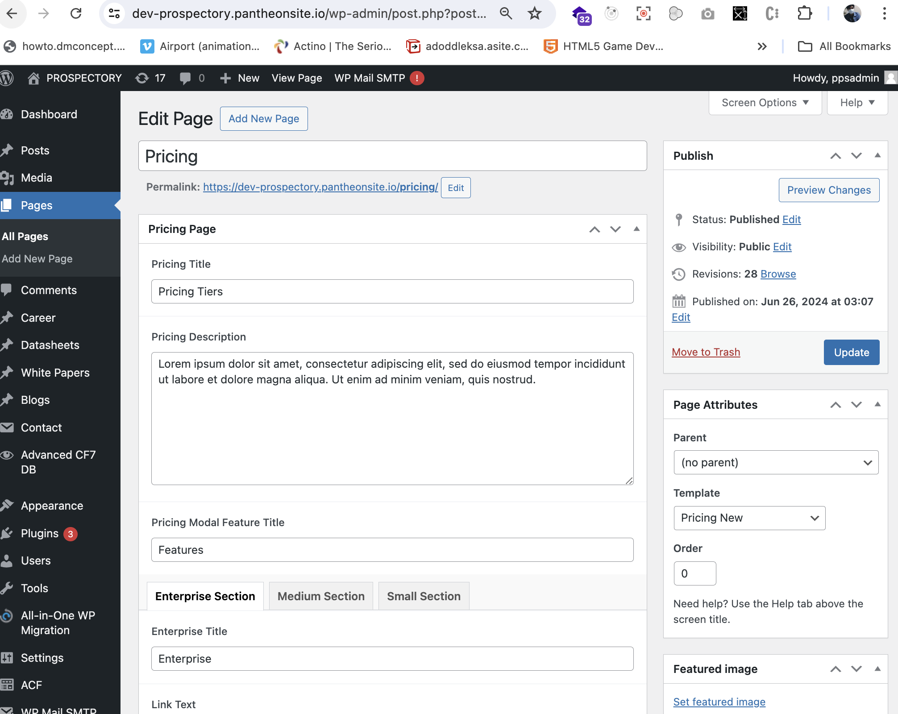

# Managing Pricing

## Introduction

This tutorial will guide you through editing the title and description of the Pricing page and managing pricing content categorized as 'Enterprise', 'Medium', and 'Small'.

## Prerequisites

- Access to a WordPress website with administrator privileges.
- Basic familiarity with WordPress administration and content management.

## Step-by-Step Guide

### Editing Pricing Page

#### Edit Title and Description

1. **Edit Title and Description**:
   - Navigate to `Pages > All Pages`.
   - Find and click on the 'Pricing' page title to open the editor.
   - Update the title and description fields as needed.
   - Click "Update" to save your changes.

### Managing Pricing Content

#### Managing Enterprise, Medium, and Small Pricing

1. **Manage Pricing Tabs**:

   - Inside the 'Pricing' page editor, you'll find tabbed sections for 'Enterprise', 'Medium', and 'Small' pricing.

2. **Add Pricing Rows**:
   - **Enterprise Pricing**:
     - Click on the 'Enterprise' tab.
     - Click on the 'Add Row' button to add a new row for Enterprise pricing.
     - Enter the details for Enterprise pricing, such as features and cost.
     - Click "Publish" or "Update" to save.
   - **Medium Pricing**:
     - Click on the 'Medium' tab.
     - Click on the 'Add Row' button to add a new row for Medium pricing.
     - Enter the details for Medium pricing, such as features and cost.
     - Click "Publish" or "Update" to save.
   - **Small Pricing**:
     - Click on the 'Small' tab.
     - Click on the 'Add Row' button to add a new row for Small pricing.
     - Enter the details for Small pricing, such as features and cost.
     - Click "Publish" or "Update" to save.

### Editing Pricing Rows

#### Edit Pricing Details

1. **Edit Pricing Rows**:

   - To edit existing pricing details, navigate to the respective tab ('Enterprise', 'Medium', or 'Small') within the 'Pricing' page editor.
   - Click on the pricing row you want to edit.
   - Modify the content and details as needed.
   - Click "Update" to save your changes.

        
