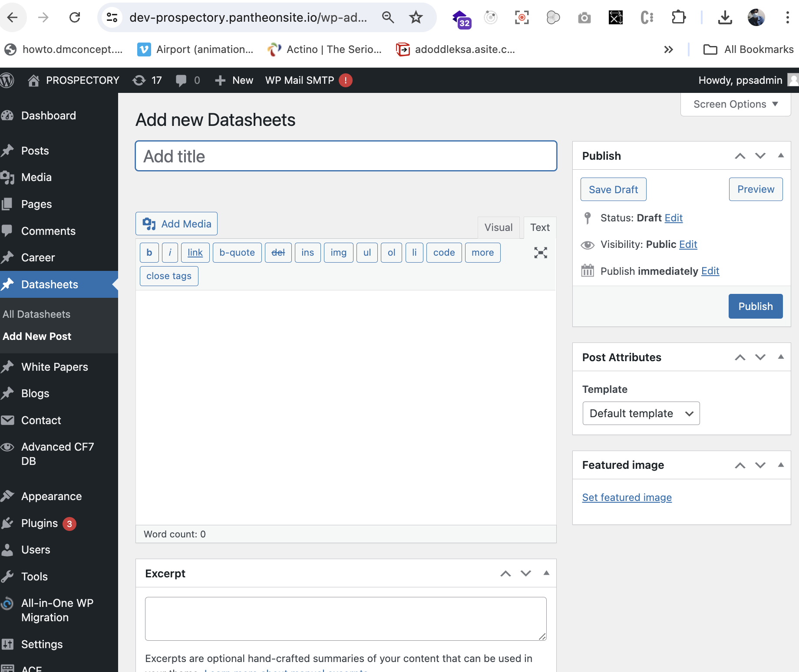

# Managing Resources

## Introduction

This tutorial will guide you through adding, editing, and deleting three types of resources—Datasheets, Whitepapers, and Blogs—using WordPress CMS in Prospectory.ai website.

## Prerequisites

- Access to a WordPress website with administrator privileges.
- Basic familiarity with WordPress administration and content management.

## Step-by-Step Guide

### Adding Content

#### Add a Datasheet

1. Go to `Datasheets > Add New`.
2. Enter the title of the datasheet in the title field.
3. Enter detailed content about the datasheet in the main content area.
4. Optionally, add a brief summary in the Excerpt field.
5. Upload a Featured Image for visual representation.
6. Click "Publish" to make the datasheet live on your website.

#### Add a Whitepaper

1. Follow the same steps as adding a Datasheet, but categorize it as a Whitepaper.
2. Provide relevant content, excerpt, and featured image.
3. Click "Publish" to make the whitepaper live on your website.

#### Add a Blog Post

1. Navigate to `Blogs > Add New`.
2. Enter a title for your blog post.
3. Write the content of your blog post.
4. Add an excerpt if desired.
5. Upload a featured image.
6. Click "Publish" to make the blog post live on your website.

### Editing Content

#### Edit a Datasheet, Whitepaper, or Blog Post

1. Navigate either `Datasheet`, `Whitepaper` or `Blogs` and find the post you want to edit.
2. Click on the post title to open the editor.
3. Make necessary changes to the title, content, excerpt, or featured image.
4. Click "Update" to save your changes.

### Deleting Content

#### Delete a Datasheet, Whitepaper, or Blog Post

1. Navigate either `Datasheet`, `Whitepaper` or `Blogs`.
2. Hover over the post you want to delete.
3. Click on "Trash" to move the post to the trash.
4. To permanently delete, go to `Trash`, hover over the post, and click "Delete Permanently."

     
