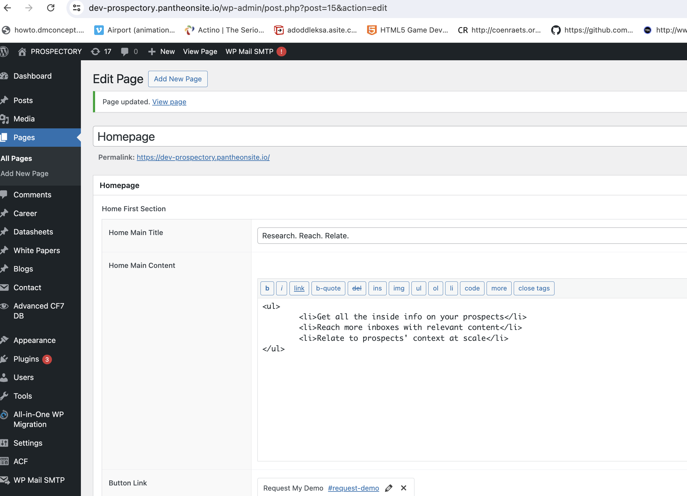

# Managing Pages

## Navigating to the Pages Section

To update content on various pages, follow these steps:

### Locate and Edit the Home Page

1. **Navigate to the Pages Section**:

   - Go to the WordPress Admin Dashboard.
   - Locate the left-hand menu.
   - Click on **Pages** to access a list of all pages on your website.

2. **Finding the Home Page**:

   - Look for the page titled **Homepage**. If your home page has a different title, find the page corresponding to your homepage content.

3. **Editing the Home Page**:
   - Hover over the title of the home page.
   - Click the **Edit** link that appears below the page title.
   - On the edit page, update content for each section as needed. This includes modifying text, uploading images, or adding button links.

**Note**: These steps apply to editing other pages as well.
     
