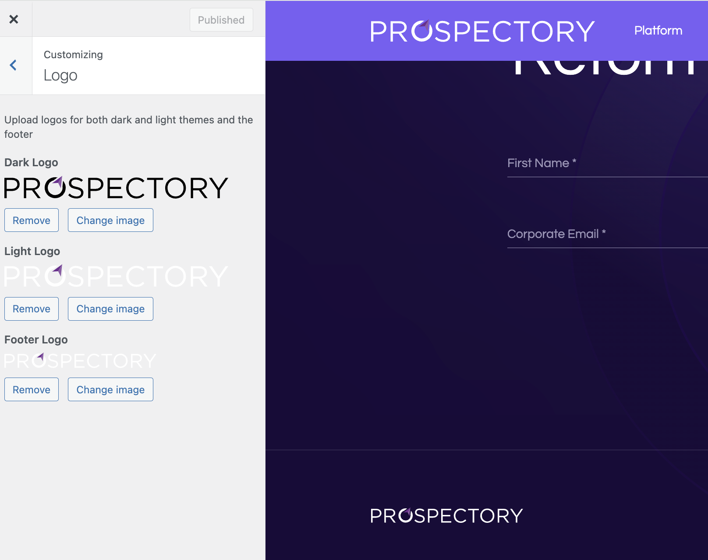

# Logo

## Steps to Edit the Logo

1. In the WordPress Admin Dashboard, go to **Appearance** > **Customize**.
2. In the Customizer, navigate to the **Logo** section.

#### Uploading Different Logo Options

1. **Dark Logo**: Click the **Select Image** button under the Dark Logo section to upload or change the logo for dark themes.
2. **Light Logo**: Click the **Select Image** button under the Light Logo section to upload or change the logo for light themes.
3. **Footer Logo**: Click the **Select Image** button under the Footer Logo section to upload or change the logo for the footer.

### Saving Your Changes

1. After uploading the logos, click the **Publish** button at the top of the Customizer to save your changes.
2. Visit your website to ensure the new logos are displayed correctly.
        
