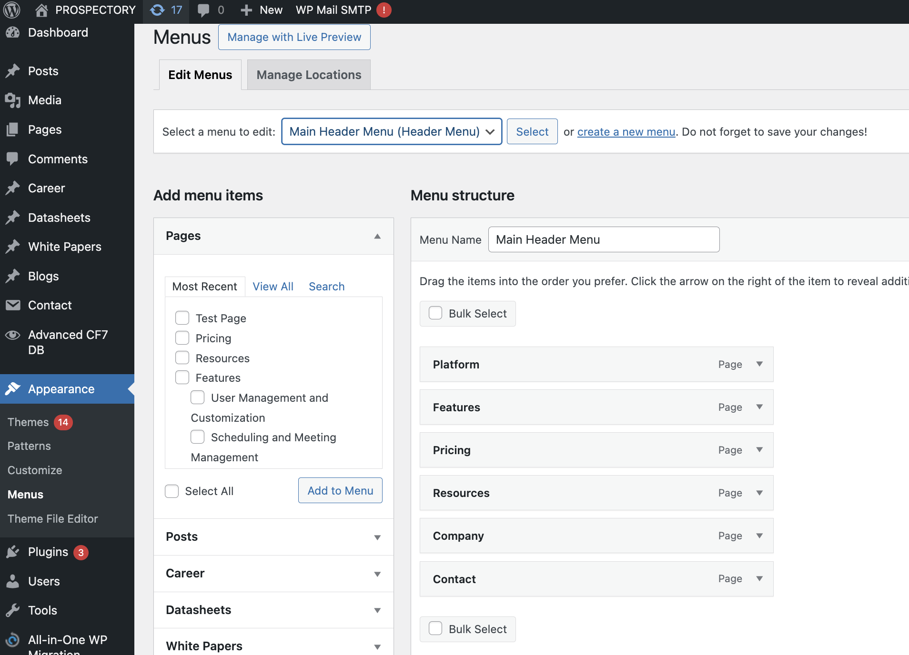

# Menus

### Steps to Edit the Menus

1. In the WordPress Admin Dashboard, go to **Appearance** > **Menus**.
2. If there is more than one menu, select the menu you want to edit from the dropdown menu and click **Select**.

#### Main Header Menu

1. **Adding Items to the Main Header Menu**:
   - On the left side, you will see different sections like Pages, Posts, Custom Links, and Categories.
   - Check the box next to the items you want to add to the menu.
   - Click the **Add to Menu** button. The items will appear at the bottom of the menu structure on the right side.
2. **Organizing Menu Items**:
   - To rearrange items, simply drag and drop them into the desired order.
   - To create a submenu (dropdown menu), drag an item slightly to the right under another item.
3. **Removing Items from the Menu**:
   - To remove an item, click the down arrow next to the item.
   - Click the **Remove** link.
4. **Saving Your Changes**:
   - After making the necessary changes, click the **Save Menu** button.
   - Visit your website to ensure the menu changes are displayed correctly.

#### Main Footer Menu

1. **Adding Items to the Main Footer Menu**:
   - On the left side, you will see different sections like Pages, Posts, Custom Links, and Categories.
   - Check the box next to the items you want to add to the menu.
   - Click the **Add to Menu** button. The items will appear at the bottom of the menu structure on the right side.
2. **Organizing Menu Items**:
   - To rearrange items, simply drag and drop them into the desired order.
   - To create a submenu (dropdown menu), drag an item slightly to the right under another item.
3. **Removing Items from the Menu**:
   - To remove an item, click the down arrow next to the item.
   - Click the **Remove** link.
4. **Saving Your Changes**:
   - After making the necessary changes, click the **Save Menu** button.
   - Visit your website to ensure the menu changes are displayed correctly.
          
