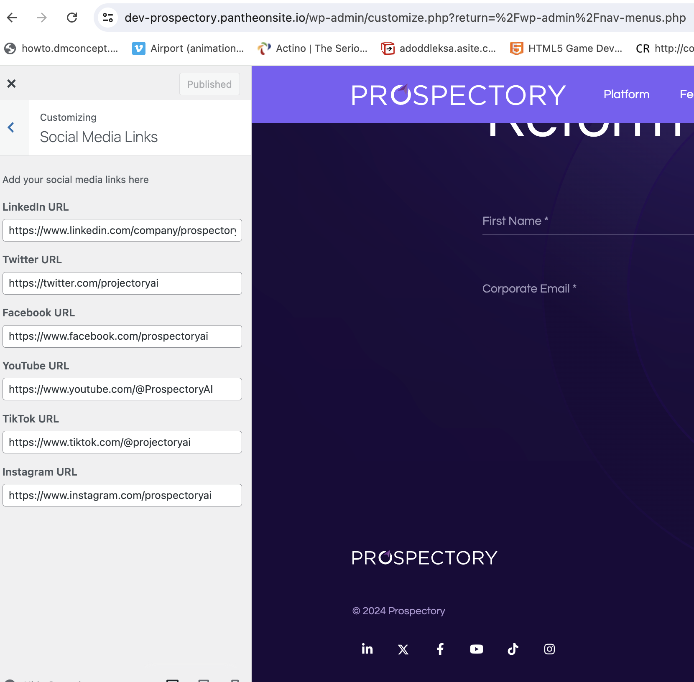

# Social Media Links

## Steps to Edit Social Media Links

1. In the WordPress Admin Dashboard, go to **Appearance** > **Customize**.
2. In the Customizer, navigate to the **Social Media Links** section.

#### Adding or Updating Social Media Links

1. **LinkedIn URL**: Enter the URL for your LinkedIn profile or page.
2. **Twitter URL**: Enter the URL for your Twitter profile.
3. **Facebook URL**: Enter the URL for your Facebook page.
4. **YouTube URL**: Enter the URL for your YouTube channel.
5. **TikTok URL**: Enter the URL for your TikTok profile.
6. **Instagram URL**: Enter the URL for your Instagram profile.

### Saving Your Changes

1. After entering the URLs, click the **Publish** button at the top of the Customizer to save your changes.
2. Visit your website to ensure the social media links are displayed correctly.
        
